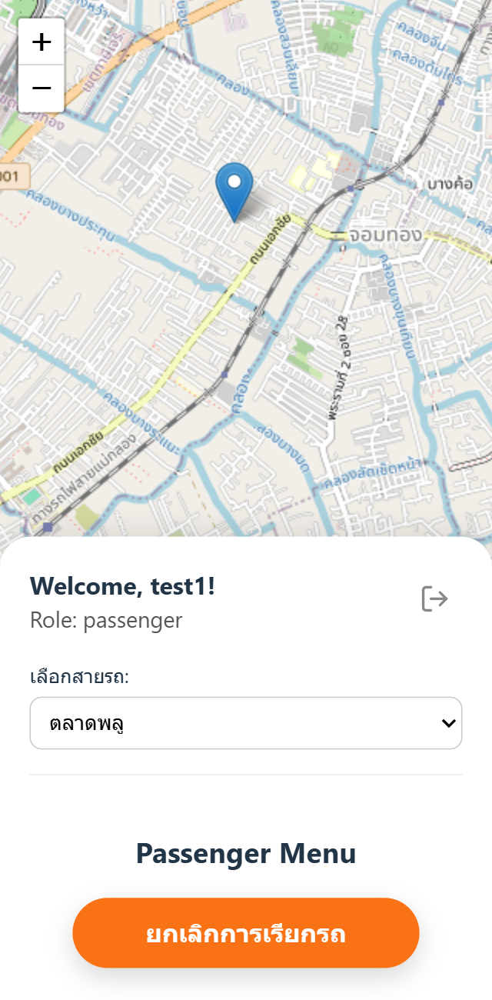

# Krapong-Go
Real-time vehicle tracking application designed for "Rod Krapong" shuttle buses. This project allows passengers to view live vehicle locations on a map and enables drivers to manage their status and location updates.

<p align="center">
  
  
</p>

## Features

- User Authentication
- Real-time Tracking
- Passenger Actions
- Driver Actions
- Mobile-First UI

## Tech Stack

**Client:** React, React Router, Leaflet, Axios, Socket.IO Client

**Server:** Node.js, Express.js, MongoDB (Mongoose), Socket.IO, Redis, JSON Web Token (JWT)

**DevOps:** Docker (for running Redis) 

## Installation

### Clone the repository

```bash
    git clone https://github.com/miramsalp/Krapong-Go.git
    cd Krapong-Go
```

### Backend Setup

```bash
    cd server
    npm install
    # set up .env in server folder example is below
    # set up docker somewhere you need redis to be running
    docker run -d -p 6379:6379 --name krapong-redis redis
    npm run dev
```
The backend server will be running at http://localhost:5000

### .env (backend)
```bash
    PORT=5000
    NODE_ENV=development

    # MongoDB Connection String
    MONGO_URI=mongodb+srv://<user>:<password>@cluster0.xxxxx.mongodb.net/myFirstDatabase?retryWrites=true&w=majority

    # JWT
    JWT_SECRET=supersecretandverylongstringforsecurity
    JWT_EXPIRES_IN=90d
```

### Frontend Setup

```bash
    cd client
    npm install
    # set up .env for frontend example below
    npm run dev
```
### .env (frontend)

```bash
    # Environment variables for the client application
    VITE_API_BASE_URL=http://localhost:5000
```

The frontend application will be available at http://localhost:5173


